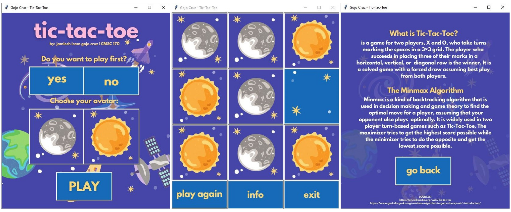

# Min-Max Algorithm (K-means)

## Task
 The goal of this project is to implement the Min-Max algorithm that would make a smart AI agent.

## Input
At the start of the program, it asks the user if it wants be X or O and then asks if he/she wants to play first.

## Output
The output of the project is a TicTacToe game with a GUI and a SMART AI agent. The user should not by any means win and the best possible state only is a draw or the AI wins.

## Alpha-Beta Pruning
The program implemented the Alpha-Beta pruning in shortening the number of branches or subtrees to traverse.

## Journal
#### Programming Language
Python with Tkinter for GUI

#### Alpha-Beta Pruning
The program implemented the alpha-beta pruning. I added a few lines of code in max_value() and min_value() function. Alpha-beta pruning is used to reduce the branching factor, decreasing the number of nodes evaluated by the minimax function. This is one way to solve the problem in minimax time complexity.

#### Problems Encountered
It took me some time to figure out how to implement the minimax algorithm, due to its recursive nature. I find it hard to trace the code.

#### How the problems were resolved
I spent a lot of my time studying the algorithm over and over until I got the idea. It is really hard to start coding without any solid foundation or idea of the problem you were solving.

#### Learnings
I must say, 'nabitin ako', in this particular topic about games, since there are a lot of games in which AI can be used. Maybe it is up to me to explore more of AI's application in different and more challenging games out there. This exercise also tested my patience! But at the end of the day, I enjoyed and learned a lot from it.
